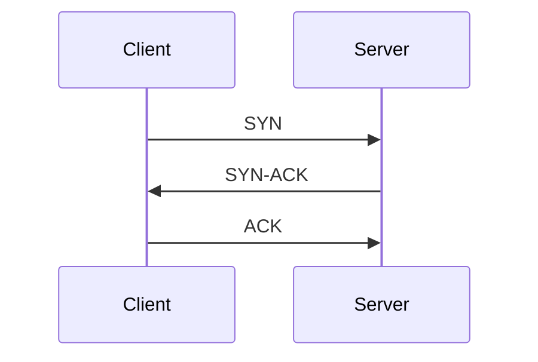

# 🛰️ Communication Protocols

Understanding common communication protocols used in web and network applications.

---

## 🌐 HTTP (HyperText Transfer Protocol)

* Used to transfer data over the web (e.g., websites, REST APIs).
* Operates over a **TCP** connection.
* Each new HTTP request can initiate a new TCP connection (unless persistent connections are used).
* Stateless and supports methods like `GET`, `POST`, `PUT`, `DELETE`.

```txt
Client --(HTTP Request)--> Server
Server --(HTTP Response)--> Client
```

**Example:**
Opening [amazon.com](https://amazon.com) involves multiple HTTP requests to load images, scripts, and content.

---

## 🔁 TCP (Transmission Control Protocol)

* Connection-oriented protocol.
* Ensures **reliable** and **ordered** delivery of data.
* Performs **three-way handshake** before data transfer.



**Example:**
Sending emails, downloading files, or accessing a website.

---

## 🚀 UDP (User Datagram Protocol)

* Connectionless protocol.
* Does **not guarantee delivery**, ordering, or duplicate protection.
* Much **faster** than TCP due to low overhead.

```txt
Client --(Data Packet)--> Server
(no handshake or confirmation)
```

**Example:**
Video conferencing (e.g., Zoom), live gaming, streaming.

---

## ⚡ HTTP/3 (based on QUIC)

* Newer version of HTTP built on top of **UDP** using **QUIC** protocol.
* Allows **multiplexed** requests over a single connection.
* Features:

  * Faster connection setup (0-RTT).
  * Header compression.
  * Better congestion control.

**Example:**
YouTube and Google services for fast, reliable content streaming.

---

## 🔐 HTTPS (HTTP Secure)

* HTTP over **SSL/TLS + TCP**.
* Encrypts all data between client and server.
* Prevents **eavesdropping**, **man-in-the-middle (MITM)** attacks, and **data tampering**.

```txt
Browser --[HTTPS: TCP + TLS]--> Server
Encrypted: Yes 🔒
```

**Example:**
Banking websites, login pages, payment gateways.

---

## 🔄 WebSocket

* Starts with an **HTTP handshake**, then upgrades to a **WebSocket** protocol.
* Enables **bi-directional (full-duplex)** communication.
* Ideal for real-time data exchange.

```txt
Client <==> Server (Live connection)
Both can send/receive messages anytime.
```

**Example:**
Live chats, collaborative editing (e.g., Google Docs), online gaming.

---

## ✉️ SMTP (Simple Mail Transfer Protocol)

* Used for **sending** emails.
* Operates over **TCP**, typically on port 25, 587, or 465 (secure).
* Works in combination with POP3 or IMAP for receiving.

```txt
Client (Email App) --> SMTP Server --> Recipient Mail Server
```

**Example:**
Gmail sending emails via `smtp.gmail.com`.

---

## 📁 FTP (File Transfer Protocol)

* Used for **transferring files** between client and server.
* Can be authenticated or anonymous.
* Operates over **TCP** (typically port 21).

```txt
Client --(FTP)--> Server
Supports: Uploads | Downloads | Rename | Delete
```

**Example:**

## Day 3 — June 20

### Namaste Frontend Design: REST API Notes (Senior Frontend Developer Perspective)

---

### 1. **What is REST API?**

REST (Representational State Transfer) is an architectural style that allows communication between client and server using HTTP protocol.

A **REST API** is an interface that helps the frontend interact with backend services (data exchange via JSON/XML formats).

---

### 2. **Why REST? Benefits**

1. **Simplicity & Ease of Use** — Easy to understand, design, and use.
2. **Stateless** — Each API call is independent; no session/data stored on server between requests.
3. **Scalability** — Supports load balancing; easily scalable system.
4. **Flexible Data Formats** — JSON/XML/HTML/text.
5. **Uniform Interface** — Clear standard rules (HTTP verbs, status codes).
6. **Caching** — Improves performance for non-changing data (like static menu or catalog).
7. **Separation of Concerns** — Frontend and backend can be built in different tech stacks.
8. **Interoperability** — Language agnostic — clients and servers can be in different languages.
9. **Easy Testing & Debugging** — Tools like Postman help in API validation.
10. **Security** — Supports various authentication mechanisms (API keys, OAuth, JWT).

---

### 3. **REST API Building Blocks**

#### **Architecture Diagram:**

```
   Client (Browser / Mobile)
            |    
     [ HTTP Request ]   --->  Server (Backend)
     <--- [ HTTP Response ]
```

#### **Request Components:**

* **URL** (Uniform Resource Locator)
* **HTTP Method** (GET, POST, PUT, DELETE)
* **Headers** (Metadata — e.g., Authentication, Content-Type)
* **Body** (Data Payload for POST/PUT)

#### **Response Components:**

* **Status Line** (HTTP Version + Status Code + Reason Phrase)
* **Headers** (Metadata returned)
* **Body** (Actual Response Data)

#### **Common HTTP Status Codes:**

* **200 OK** — Successful
* **201 Created** — Resource created
* **400 Bad Request** — Client error
* **401 Unauthorized** — Auth required
* **404 Not Found** — Resource missing
* **500 Internal Server Error** — Server failure

---

### 4. **How to Build REST API?**

1. Decide endpoints — what resources (e.g., `/users`, `/products`)?
2. Choose HTTP methods — GET/POST/PUT/DELETE.
3. Design response format (JSON recommended).
4. Handle error codes properly.
5. Secure with authentication (API key, OAuth, JWT).

---

### 5. **Consume REST API (Using Postman)**

* Install Postman.
* Choose Method (GET/POST/etc).
* Enter URL.
* Add Headers (if required).
* Send Request & View Response.

---

### 6. **HTTP 1 / 2 / 3 Differences (High-Level)**

| Feature       | HTTP/1.1              | HTTP/2                   | HTTP/3 (QUIC)                 |
| ------------- | --------------------- | ------------------------ | ----------------------------- |
| Connection    | Multiple TCP          | Single TCP (Multiplexed) | UDP (Multiplexed)             |
| Performance   | Head-of-Line Blocking | Faster, binary framing   | Low latency, built for mobile |
| Security      | Optional TLS          | Mandatory TLS            | Mandatory TLS                 |
| Example Usage | Legacy systems        | Modern web apps          | Experimental/Latest           |

---

### 7. **REST API Best Practices (Creator & Consumer Perspective)**

#### **For API Creator:**

* Use clear & consistent naming (`/users`, `/products`).
* Support filtering, sorting, pagination (`?limit=10&page=2`).
* Use proper HTTP status codes.
* Secure APIs with auth tokens.
* Provide versioning (`/v1/`).

#### **For API Consumer:**

* Handle errors & edge cases.
* Use caching for GET requests.
* Implement retries for transient failures.
* Validate API responses.

---

### 8. **Advanced Concepts - High Level**

#### **System Design Architecture View:**

```
          [ Client (Frontend: React/Angular) ]
                        |
                        V
                 [ REST API (HTTP) ]
                        |
            +----------------------+
            |     Backend Server    |
            +----------------------+
                        |
                 [ Database ]
```

* **1-Tier:** UI + Backend + DB = Same system (Monolith)
* **2-Tier:** Frontend & Backend separated (API in-between)
* **3-Tier:** Frontend -> API Gateway -> Backend + DB (Cloud Native)

#### **Role of REST API:**

* Acts as contract/interface between client and server.
* Defines format, protocol, and behavior of communication.

#### **Communication Format:**

* Mostly JSON (lightweight, easy to parse).

---

### References:

* [https://dummyjson.com/](https://dummyjson.com/)
* Namaste Frontend System Design Course

---

### 🚀 **Express.js Setup**

1️⃣ **Initialize Node project**

```bash
npm init -y
```

2️⃣ **Install Express**

```bash
npm install express --save
```

3️⃣ **(Optional) Use ES6 Modules**
In `package.json`, set:

```json
{
  "name": "systemdesign",
  "version": "1.0.0",
  "description": "RestApi",
  "main": "index.js",
  "type": "module",
  "scripts": {
    "start": "node index.js",
    "test": "echo \"Error: no test specified\" && exit 1"
  },
  "author": "SJ",
  "license": "ISC",
  "dependencies": {
    "express": "^5.1.0"
  }
}
```

4️⃣ **Create `index.js`**

```javascript
import express from 'express';

const app = express();
app.use(express.json()); // Middleware to parse JSON body

const PORT = 5111;

app.listen(PORT, () => {
  console.log(`Server running at http://localhost:${PORT}`);
});
```

---

### 🛠 **Building Blocks**

* **URL Parts**

  ```
  http://www.example.com/forum/questions/tag?key=value#top
  ```

  | Part                   | Description                   |
  | ---------------------- | ----------------------------- |
  | `http://`              | Scheme                        |
  | `www`                  | Subdomain                     |
  | `example`              | Domain                        |
  | `com`                  | TLD                           |
  | `/forum/questions/tag` | Path                          |
  | `?key=value`           | Query parameter               |
  | `#top`                 | Fragment (not sent to server) |

---

### ✅ **CRUD API Features**

Example Base URL:

```
http://localhost:5111/api/todos
http://localhost:5111/api/users
```

| Feature     | HTTP Method | Example                                        |
| ----------- | ----------- | ---------------------------------------------- |
| Create Todo | POST        | `POST /api/todos`                              |
| Read Todos  | GET         | `GET /api/todos`                               |
| Update Todo | PUT/PATCH   | `PUT /api/todos/:id` or `PATCH /api/todos/:id` |
| Delete Todo | DELETE      | `DELETE /api/todos/:id`                        |

Other HTTP methods:

* `HEAD` — Same as GET but no response body
* `OPTIONS` — Describe supported HTTP methods

---

### 📝 **Sample Routes**

```javascript
// Read all todos
app.get('/api/todos', (req, res) => {
  res.send('List of todos');
});

// Create a todo
app.post('/api/todos', (req, res) => {
  res.send('Todo created');
});

// Update a todo
app.put('/api/todos/:id', (req, res) => {
  res.send(`Todo ${req.params.id} updated`);
});

// Delete a todo
app.delete('/api/todos/:id', (req, res) => {
  res.send(`Todo ${req.params.id} deleted`);
});
```

---

### ⚡ **Auto-start server during development**

Install **nodemon**:

```bash
npm install nodemon --save-dev
```

Add to `package.json` scripts:

```json
"scripts": {
  "start": "node index.js",
  "dev": "nodemon index.js"
}
```

Run:

```bash
npm run dev
```

---

### 📌 **System Design Angle**

* Think in terms of RESTful routes.
* Modularize: Separate routes, controllers, and models (even in simple TODO app).
* API best practice: Versioning (e.g., `/api/v1/todos`).

---

👉 **Next enhancement ideas**

* Add validations (e.g., using `Joi` or `express-validator`).
* Connect to a DB (MongoDB / PostgreSQL).
* Implement authentication (JWT / OAuth).

---

Below is a cleaned‑up, expanded set of your HTTP headers and status‑code notes—formatted into three GitHub‑ready markdown tables. I’ve added a few common headers you may have missed and given clear use‑cases and examples.

---

### Request Headers

| Header                | Use Case                                          | Example                                                  |
| --------------------- | ------------------------------------------------- | -------------------------------------------------------- |
| **Host**              | Target server domain (virtual host routing)       | `Host: www.cdn.example.com`                              |
| **Origin**            | Domain of the page issuing the request (CORS)     | `Origin: https://app.example.com`                        |
| **Referer**           | Previous page URL that triggered the request      | `Referer: https://app.example.com/dashboard`             |
| **User‑Agent**        | Client identification (OS, browser, version)      | `User-Agent: Mozilla/5.0 (Windows NT 10.0; Win64; x64)…` |
| **Accept**            | Desired response content types                    | `Accept: text/html,application/json`                     |
| **Accept‑Language**   | Preferred languages for response                  | `Accept-Language: en-US,en;q=0.9`                        |
| **Accept‑Encoding**   | Supported compression algorithms                  | `Accept-Encoding: gzip, deflate, br`                     |
| **Connection**        | Connection management (keep‑alive vs close)       | `Connection: keep-alive`                                 |
| **Authorization**     | Credentials or tokens for authenticated requests  | `Authorization: Bearer <token>`                          |
| **Cookie**            | Previously set cookies (session, tokens, prefs)   | `Cookie: sessionId=abc123; theme=dark`                   |
| **If‑Modified‑Since** | Conditional fetch: only if resource updated since | `If-Modified-Since: Wed, 21 Oct 2025 07:28:00 GMT`       |
| **If‑None‑Match**     | Conditional fetch via ETag matching               | `If-None-Match: "686897696a7c876b7e"`                    |
| **Cache‑Control**     | Client‑side caching directives                    | `Cache-Control: max-age=86400`                           |
| **Range**             | Request only a portion of a resource              | `Range: bytes=0-1023`                                    |
| **X‑Requested‑With**  | Ajax request indicator (often `XMLHttpRequest`)   | `X-Requested-With: XMLHttpRequest`                       |

---

### Response Headers

| Header                          | Use Case                                           | Example                                              |
| ------------------------------- | -------------------------------------------------- | ---------------------------------------------------- |
| **Date**                        | Time when response was generated                   | `Date: Tue, 06 Jul 2025 14:25:30 GMT`                |
| **Server**                      | Server software/info                               | `Server: nginx/1.18.0 (Ubuntu)`                      |
| **Content‑Type**                | MIME type of response body                         | `Content-Type: application/json; charset=utf-8`      |
| **Content‑Length**              | Byte length of response body                       | `Content-Length: 348`                                |
| **Content‑Encoding**            | Compression applied to the body                    | `Content-Encoding: gzip`                             |
| **Set‑Cookie**                  | Instructs client to store a cookie                 | `Set-Cookie: sessionId=abc123; Path=/; HttpOnly`     |
| **Cache‑Control**               | Caching directives for clients/proxies             | `Cache-Control: public, max-age=3600`                |
| **Last‑Modified**               | Last modification date of the resource             | `Last-Modified: Mon, 05 Jul 2025 12:00:00 GMT`       |
| **ETag**                        | Unique identifier for resource version (cache key) | `ETag: "5d8c72a5edda3"`                              |
| **Expires**                     | Absolute expiry date/time for cached response      | `Expires: Wed, 07 Jul 2025 14:25:30 GMT`             |
| **Location**                    | Redirect target URL                                | `Location: https://www.example.com/newpage`          |
| **Vary**                        | Specifies which request headers affect caching     | `Vary: Accept-Encoding, User-Agent`                  |
| **Access‑Control‑Allow‑Origin** | CORS: permitted origin(s)                          | `Access-Control-Allow-Origin: *`                     |
| **Allow**                       | HTTP methods allowed on this resource              | `Allow: GET, POST, OPTIONS`                          |
| **WWW‑Authenticate**            | Challenge for authentication schemes               | `WWW-Authenticate: Basic realm="User Visible Realm"` |
| **Content‑Security‑Policy**     | Security policy to control resource loading        | `Content-Security-Policy: default-src 'self'`        |

---

### HTTP status code ranges
| Range   | Category      | Common Codes & Descriptions                                                                                                                                                                                                                                                                                                                                                                                                                                            |
| ------- | ------------- | ----------------------------------------------------------------------------------------------------------------------------------------------------------------------------------------------------------------------------------------------------------------------------------------------------------------------------------------------------------------------------------------------------------------------------------------------------------------------------------- |
| **1XX** | Informational | **100 Continue**: client may continue with request body<br>**101 Switching Protocols**: server switching to different protocol as requested<br>**102 Processing**: server has received request and is processing it (WebDAV)                                                                                                                                                                                                                                                        |
| **2XX** | Success       | **200 OK**: standard success response<br>**201 Created**: new resource has been created<br>**202 Accepted**: request accepted but not yet processed<br>**204 No Content**: successful, but no body returned<br>**206 Partial Content**: range responses                                                                                                                                                                                                                             |
| **3XX** | Redirection   | **300 Multiple Choices**: multiple representations available<br>**301 Moved Permanently**: resource permanently at new URI (clients should update links)<br>**302 Found**: temporary redirect (legacy “Moved Temporarily”)<br>**303 See Other**: redirect via GET<br>**304 Not Modified**: cached version still valid<br>**307 Temporary Redirect**: same method, temporary<br>**308 Permanent Redirect**: same method, permanent                                                   |
| **4XX** | Client Error  | **400 Bad Request**: malformed syntax or invalid data<br>**401 Unauthorized**: authentication required or failed<br>**403 Forbidden**: valid auth but insufficient permissions<br>**404 Not Found**: resource doesn’t exist<br>**405 Method Not Allowed**: HTTP method not supported by resource<br>**408 Request Timeout**: client took too long to send request<br>**409 Conflict**: request conflicts with current state of resource<br>**429 Too Many Requests**: rate limiting |
| **5XX** | Server Error  | **500 Internal Server Error**: generic server fault<br>**501 Not Implemented**: server doesn’t support feature<br>**502 Bad Gateway**: invalid response from upstream server<br>**503 Service Unavailable**: server overloaded or down for maintenance<br>**504 Gateway Timeout**: upstream server timed out<br>**505 HTTP Version Not Supported**: protocol version not supported<br>**511 Network Authentication Required**: client needs to authenticate to gain network access  |

---

Sure! Here is the **GraphQL Overview and Key Concepts** formatted in clean Markdown for your **GitHub Notes**:

---

# GraphQL — Overview and Key Concepts

## What is GraphQL?

GraphQL is a **query language** and **runtime** for APIs that allows clients to request exactly the data they need — no more, no less.
It was developed by **Facebook (2012)** and open-sourced in **2015**.

* Clients send **queries** (for reading) or **mutations** (for writing) against a **single endpoint** over HTTP.
* The API is strongly typed using a **schema** written in SDL (Schema Definition Language).
* Each field has a **resolver** on the server to fetch the data (from DB, REST API, or other services).

GraphQL APIs are **data-source agnostic** — they unify data from multiple sources transparently.

---

## Why Use GraphQL? — Key Benefits

* ✅ **Ask for exactly what you need** — Avoid over-fetching and under-fetching.
* ✅ **Single round-trip** — Fetch nested & related data in one query.
* ✅ **Strong typing & schema** — Enables validation, introspection, and tooling support.
* ✅ **No versioning required** — The schema evolves; clients query what they need.
* ✅ **Real-time support with Subscriptions** — Using WebSockets for live updates.
* ✅ **Improved Developer Experience** — IDEs, auto-completion, schema exploration (GraphiQL, Apollo Studio).

---

## GraphQL vs REST

| Feature             | REST                               | GraphQL                             |
| ------------------- | ---------------------------------- | ----------------------------------- |
| Data Fetching       | Multiple endpoints, fixed response | Single endpoint, flexible queries   |
| Request Structure   | Fixed Structure + HTTP Methods     | Flexible (Query + Mutation)         |
| Over/Under Fetching | Common issue                       | Avoided with tailored queries       |
| Response size       | fixed                              | Flexible  |
| Versioning          | Often required                     | Schema evolves, no breaking changes |
| Error Handling      | HTTP status codes                  | Standardized JSON error responses   |
| Real-time Support   | Polling/Webhooks                   | Subscriptions (WebSockets)          |
| Schema & Typing     | Optional/OpenAPI/Swagger           | Required & strongly typed           |
| Tooling             | Postman, Swagger                   | GraphiQL, Apollo Studio, Playground |
| Caching             | Relies on HTTP Caching             | Fine grained                        |
| Client Control      | No client cant decide              | Yes, client can decide              |
| Adoption & Community| Widely                             | Rapidly growing                     |

---

## Core Concepts

### Schema & Types

Defines the data contract between client and server.
Example:

```graphql
type Country {
  code: String!
  name: String!
  currency: String
  phone: String
}

type Query {
  country(code: String!): Country
  countries: [Country!]!
}
```

---

### Queries & Mutations

* **Queries**: Fetch data

```graphql
query {
  country(code: "BE") {
    name
    languages {
      name
    }
  }
}
```

* **Mutations**: Modify data

```graphql
mutation {
  addCountry(input: { code: "FR", name: "France" }) {
    code
    name
  }
}
```

* **Subscriptions**: Real-time updates (example syntax)

```graphql
subscription {
  countryAdded {
    code
    name
  }
}
```

---

### Resolvers

Functions that handle fetching or modifying data for a given field.

Resolver Example in JavaScript (Apollo Server):

```js
const resolvers = {
  Query: {
    countries: () => getCountriesFromDB(),
    country: (_, { code }) => findCountryByCode(code),
  },
};
```

---

### Introspection

* Built-in capability to query the schema itself.
* Enables auto-complete, code generation, schema docs, etc.

Example:

```graphql
{
  __schema {
    types {
      name
    }
  }
}
```

---

## Example: Nested Query

```graphql
query {
  continents {
    name
    countries {
      name
      languages {
        name
      }
    }
  }
}
```

---

## How to Build a GraphQL API (Quick Steps)

1. **Define Schema** (SDL)
2. **Write Resolvers** for Queries, Mutations, Subscriptions
3. **Set up Server** with GraphQL library (Apollo Server, GraphQL.js, etc.)
4. **Connect Data Sources** (DB, REST APIs, etc.)
5. **Test with Playground / GraphiQL**

---

## Popular GraphQL Tools & Libraries

* 🚀 **Apollo Server & Client**
* 🛠️ **GraphQL.js** (Reference implementation)
* 🖥️ **GraphQL Playground**
* 🧩 **Apollo Federation** (Microservices)
* 💬 **Subscriptions with WebSockets**
* 📜 **GraphQL Code Generator**

---

## Public GraphQL APIs to Explore

* 🌍 [https://countries.trevorblades.com/](https://countries.trevorblades.com/)
* 📚 [https://api.spacex.land/graphql/](https://api.spacex.land/graphql/)

---

