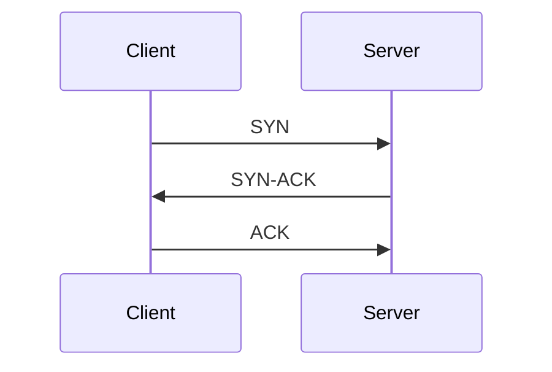

# 🛰️ Communication Protocols

Understanding common communication protocols used in web and network applications.

---

## 🌐 HTTP (HyperText Transfer Protocol)

* Used to transfer data over the web (e.g., websites, REST APIs).
* Operates over a **TCP** connection.
* Each new HTTP request can initiate a new TCP connection (unless persistent connections are used).
* Stateless and supports methods like `GET`, `POST`, `PUT`, `DELETE`.

```txt
Client --(HTTP Request)--> Server
Server --(HTTP Response)--> Client
```

**Example:**
Opening [amazon.com](https://amazon.com) involves multiple HTTP requests to load images, scripts, and content.

---

## 🔁 TCP (Transmission Control Protocol)

* Connection-oriented protocol.
* Ensures **reliable** and **ordered** delivery of data.
* Performs **three-way handshake** before data transfer.



**Example:**
Sending emails, downloading files, or accessing a website.

---

## 🚀 UDP (User Datagram Protocol)

* Connectionless protocol.
* Does **not guarantee delivery**, ordering, or duplicate protection.
* Much **faster** than TCP due to low overhead.

```txt
Client --(Data Packet)--> Server
(no handshake or confirmation)
```

**Example:**
Video conferencing (e.g., Zoom), live gaming, streaming.

---

## ⚡ HTTP/3 (based on QUIC)

* Newer version of HTTP built on top of **UDP** using **QUIC** protocol.
* Allows **multiplexed** requests over a single connection.
* Features:

  * Faster connection setup (0-RTT).
  * Header compression.
  * Better congestion control.

**Example:**
YouTube and Google services for fast, reliable content streaming.

---

## 🔐 HTTPS (HTTP Secure)

* HTTP over **SSL/TLS + TCP**.
* Encrypts all data between client and server.
* Prevents **eavesdropping**, **man-in-the-middle (MITM)** attacks, and **data tampering**.

```txt
Browser --[HTTPS: TCP + TLS]--> Server
Encrypted: Yes 🔒
```

**Example:**
Banking websites, login pages, payment gateways.

---

## 🔄 WebSocket

Great question! Let’s break it down.

---

## 🔌 What are WebSockets?

* **WebSockets** are a communication protocol that allows **two-way, persistent, real-time communication** between a client (like a browser) and a server.
* Unlike traditional HTTP (request-response), once a WebSocket connection is established, **both the client and server can send data anytime** without re-establishing the connection.
* This makes them ideal for **real-time applications**.

---

## ⚡ How WebSockets Work

1. A client (browser/app) requests a WebSocket connection to the server.
2. If the server accepts, the connection stays **open**.
3. Data can now “stream” in both directions continuously until either side closes the connection.

This is different from:

* **HTTP polling** → client keeps asking the server “any updates?” (inefficient).
* **HTTP long-polling** → client holds a request open until the server has data, then repeats.
* **WebSocket** → single persistent connection with instant communication.

---

## 🛠️ Real-World Use Cases of WebSockets

### 1. **Chat Applications** (like WhatsApp Web, Slack, Discord)

* Users send messages → instantly broadcasted to others.
* Typing indicators, online/offline status, and read receipts also rely on real-time communication.

### 2. **Live Notifications**

* Social media (e.g., Facebook “likes” or Twitter “new follower” alerts).
* E-commerce (“Your order has shipped!” without refreshing).
* Sports apps delivering live score updates.

### 3. **Online Gaming**

* Real-time multiplayer games (e.g., shooting games, strategy games).
* Players’ actions must be broadcast instantly to all other players.

### 4. **Collaboration Tools**

* Google Docs, Notion, or Figma use real-time updates.
* Multiple users editing a document/board at once → changes sync instantly.

### 5. **Financial Applications**

* Stock market tickers (real-time prices).
* Cryptocurrency exchanges (live order book updates).
* Forex platforms streaming live exchange rates.

### 6. **IoT Devices**

* Smart home systems where devices (thermostats, lights) send real-time updates.
* Industrial sensors transmitting live telemetry data.

### 7. **Customer Support**

* Real-time support chats or video call integrations.
* Agents get instant updates when customers send messages.

### 8. **Live Streaming**

* Some streaming platforms use WebSockets for chat alongside video.
* Real-time reactions (like Twitch emojis, YouTube live chat).

---

## 📊 Quick Example: Stock Ticker

Imagine a stock trading app:

* With **HTTP**, the client would need to poll every second: “what’s the latest stock price?” → inefficient and delayed.
* With **WebSockets**, as soon as the stock price changes, the server pushes the new value to all connected clients instantly.

---

👉 So in short:
**Use WebSockets when you need fast, continuous, two-way communication in real time.**

Would you like me to also show you **how WebSockets differ from alternatives like SSE (Server-Sent Events) and HTTP/2 streams** with a comparison chart?
Perfect 👌 — let’s compare **WebSockets, SSE (Server-Sent Events), and HTTP/2 streams** so you can see when to use each.

---

## 🔄 Comparison of Real-Time Communication Methods

| Feature                   | **WebSockets**                                                                  | **SSE (Server-Sent Events)**                          | **HTTP/2 Streams**                                             |
| ------------------------- | ------------------------------------------------------------------------------- | ----------------------------------------------------- | -------------------------------------------------------------- |
| **Direction**             | **Full-duplex** (client ↔ server)                                               | **One-way** (server → client only)                    | Multiplexed streams over one connection                        |
| **Protocol**              | Works over TCP, usually upgrades from HTTP (`ws://` or `wss://`)                | Standard HTTP (`text/event-stream`)                   | Built into HTTP/2                                              |
| **Persistent Connection** | Yes                                                                             | Yes                                                   | Yes                                                            |
| **Best For**              | Chat apps, multiplayer games, collaborative tools, bidirectional real-time data | News feeds, stock tickers, live scores, notifications | Efficient multiplexing of multiple HTTP requests/responses     |
| **Browser Support**       | Widely supported                                                                | Widely supported, but only server → client            | Depends on HTTP/2 support (modern browsers/servers support it) |
| **Scalability**           | More complex (needs load balancing & sticky sessions sometimes)                 | Simpler to scale (still HTTP-based)                   | Scaling depends on HTTP/2 infra                                |
| **Complexity**            | Medium (custom protocol on top of TCP)                                          | Low (just streams text messages)                      | High (requires HTTP/2 server setup)                            |
| **Data Format**           | Binary or text                                                                  | Text only (UTF-8)                                     | Any HTTP payload                                               |
| **Use Case Examples**     | - WhatsApp Web                                                                  |                                                       |                                                                |

* Online gaming
* Figma/Google Docs | - Live news updates
* Social media notifications
* Stock price feeds | - Efficient APIs
* Multiple simultaneous requests
* Server push for assets |

---

## 🔑 Quick Takeaways

* **WebSockets** → best for **two-way communication** (chat, games, collaborative editing).
* **SSE** → best for **lightweight one-way updates** (notifications, dashboards, live feeds).
* **HTTP/2 streams** → best for **APIs or web apps** needing multiplexed requests, not really real-time interactive use cases like WebSockets.

---

⚡ In practice:

* **Chat app** → WebSockets.
* **Sports score updates** → SSE.
* **High-performance API calls** (multiple requests without extra connections) → HTTP/2 streams.

---

## ✉️ SMTP (Simple Mail Transfer Protocol)

* Used for **sending** emails.
* Operates over **TCP**, typically on port 25, 587, or 465 (secure).
* Works in combination with POP3 or IMAP for receiving.

```txt
Client (Email App) --> SMTP Server --> Recipient Mail Server
```

**Example:**
Gmail sending emails via `smtp.gmail.com`.

---

## 📁 FTP (File Transfer Protocol)

* Used for **transferring files** between client and server.
* Can be authenticated or anonymous.
* Operates over **TCP** (typically port 21).

```txt
Client --(FTP)--> Server
Supports: Uploads | Downloads | Rename | Delete
```

**Example:**

## Day 3 — June 20

### Namaste Frontend Design: REST API Notes (Senior Frontend Developer Perspective)

---

### 1. **What is REST API?**

REST (Representational State Transfer) is an architectural style that allows communication between client and server using HTTP protocol.

A **REST API** is an interface that helps the frontend interact with backend services (data exchange via JSON/XML formats).

---

### 2. **Why REST? Benefits**

1. **Simplicity & Ease of Use** — Easy to understand, design, and use.
2. **Stateless** — Each API call is independent; no session/data stored on server between requests.
3. **Scalability** — Supports load balancing; easily scalable system.
4. **Flexible Data Formats** — JSON/XML/HTML/text.
5. **Uniform Interface** — Clear standard rules (HTTP verbs, status codes).
6. **Caching** — Improves performance for non-changing data (like static menu or catalog).
7. **Separation of Concerns** — Frontend and backend can be built in different tech stacks.
8. **Interoperability** — Language agnostic — clients and servers can be in different languages.
9. **Easy Testing & Debugging** — Tools like Postman help in API validation.
10. **Security** — Supports various authentication mechanisms (API keys, OAuth, JWT).

---

### 3. **REST API Building Blocks**

#### **Architecture Diagram:**

```
   Client (Browser / Mobile)
            |    
     [ HTTP Request ]   --->  Server (Backend)
     <--- [ HTTP Response ]
```

#### **Request Components:**

* **URL** (Uniform Resource Locator)
* **HTTP Method** (GET, POST, PUT, DELETE)
* **Headers** (Metadata — e.g., Authentication, Content-Type)
* **Body** (Data Payload for POST/PUT)

#### **Response Components:**

* **Status Line** (HTTP Version + Status Code + Reason Phrase)
* **Headers** (Metadata returned)
* **Body** (Actual Response Data)

#### **Common HTTP Status Codes:**

* **200 OK** — Successful
* **201 Created** — Resource created
* **400 Bad Request** — Client error
* **401 Unauthorized** — Auth required
* **404 Not Found** — Resource missing
* **500 Internal Server Error** — Server failure

---

### 4. **How to Build REST API?**

1. Decide endpoints — what resources (e.g., `/users`, `/products`)?
2. Choose HTTP methods — GET/POST/PUT/DELETE.
3. Design response format (JSON recommended).
4. Handle error codes properly.
5. Secure with authentication (API key, OAuth, JWT).

---

### 5. **Consume REST API (Using Postman)**

* Install Postman.
* Choose Method (GET/POST/etc).
* Enter URL.
* Add Headers (if required).
* Send Request & View Response.

---

### 6. **HTTP 1 / 2 / 3 Differences (High-Level)**

| Feature       | HTTP/1.1              | HTTP/2                   | HTTP/3 (QUIC)                 |
| ------------- | --------------------- | ------------------------ | ----------------------------- |
| Connection    | Multiple TCP          | Single TCP (Multiplexed) | UDP (Multiplexed)             |
| Performance   | Head-of-Line Blocking | Faster, binary framing   | Low latency, built for mobile |
| Security      | Optional TLS          | Mandatory TLS            | Mandatory TLS                 |
| Example Usage | Legacy systems        | Modern web apps          | Experimental/Latest           |

---

### 7. **REST API Best Practices (Creator & Consumer Perspective)**

#### **For API Creator:**

* Use clear & consistent naming (`/users`, `/products`).
* Support filtering, sorting, pagination (`?limit=10&page=2`).
* Use proper HTTP status codes.
* Secure APIs with auth tokens.
* Provide versioning (`/v1/`).

#### **For API Consumer:**

* Handle errors & edge cases.
* Use caching for GET requests.
* Implement retries for transient failures.
* Validate API responses.

---

### 8. **Advanced Concepts - High Level**

#### **System Design Architecture View:**

```
          [ Client (Frontend: React/Angular) ]
                        |
                        V
                 [ REST API (HTTP) ]
                        |
            +----------------------+
            |     Backend Server    |
            +----------------------+
                        |
                 [ Database ]
```

* **1-Tier:** UI + Backend + DB = Same system (Monolith)
* **2-Tier:** Frontend & Backend separated (API in-between)
* **3-Tier:** Frontend -> API Gateway -> Backend + DB (Cloud Native)

#### **Role of REST API:**

* Acts as contract/interface between client and server.
* Defines format, protocol, and behavior of communication.

#### **Communication Format:**

* Mostly JSON (lightweight, easy to parse).

---

### References:

* [https://dummyjson.com/](https://dummyjson.com/)
* Namaste Frontend System Design Course

---

### 🚀 **Express.js Setup**

1️⃣ **Initialize Node project**

```bash
npm init -y
```

2️⃣ **Install Express**

```bash
npm install express --save
```

3️⃣ **(Optional) Use ES6 Modules**
In `package.json`, set:

```json
{
  "name": "systemdesign",
  "version": "1.0.0",
  "description": "RestApi",
  "main": "index.js",
  "type": "module",
  "scripts": {
    "start": "node index.js",
    "test": "echo \"Error: no test specified\" && exit 1"
  },
  "author": "SJ",
  "license": "ISC",
  "dependencies": {
    "express": "^5.1.0"
  }
}
```

4️⃣ **Create `index.js`**

```javascript
import express from 'express';

const app = express();
app.use(express.json()); // Middleware to parse JSON body

const PORT = 5111;

app.listen(PORT, () => {
  console.log(`Server running at http://localhost:${PORT}`);
});
```

---

### 🛠 **Building Blocks**

* **URL Parts**

  ```
  http://www.example.com/forum/questions/tag?key=value#top
  ```

  | Part                   | Description                   |
  | ---------------------- | ----------------------------- |
  | `http://`              | Scheme                        |
  | `www`                  | Subdomain                     |
  | `example`              | Domain                        |
  | `com`                  | TLD                           |
  | `/forum/questions/tag` | Path                          |
  | `?key=value`           | Query parameter               |
  | `#top`                 | Fragment (not sent to server) |

---

### ✅ **CRUD API Features**

Example Base URL:

```
http://localhost:5111/api/todos
http://localhost:5111/api/users
```

| Feature     | HTTP Method | Example                                        |
| ----------- | ----------- | ---------------------------------------------- |
| Create Todo | POST        | `POST /api/todos`                              |
| Read Todos  | GET         | `GET /api/todos`                               |
| Update Todo | PUT/PATCH   | `PUT /api/todos/:id` or `PATCH /api/todos/:id` |
| Delete Todo | DELETE      | `DELETE /api/todos/:id`                        |

Other HTTP methods:

* `HEAD` — Same as GET but no response body
* `OPTIONS` — Describe supported HTTP methods

---

### 📝 **Sample Routes**

```javascript
// Read all todos
app.get('/api/todos', (req, res) => {
  res.send('List of todos');
});

// Create a todo
app.post('/api/todos', (req, res) => {
  res.send('Todo created');
});

// Update a todo
app.put('/api/todos/:id', (req, res) => {
  res.send(`Todo ${req.params.id} updated`);
});

// Delete a todo
app.delete('/api/todos/:id', (req, res) => {
  res.send(`Todo ${req.params.id} deleted`);
});
```

---

### ⚡ **Auto-start server during development**

Install **nodemon**:

```bash
npm install nodemon --save-dev
```

Add to `package.json` scripts:

```json
"scripts": {
  "start": "node index.js",
  "dev": "nodemon index.js"
}
```

Run:

```bash
npm run dev
```

---

### 📌 **System Design Angle**

* Think in terms of RESTful routes.
* Modularize: Separate routes, controllers, and models (even in simple TODO app).
* API best practice: Versioning (e.g., `/api/v1/todos`).

---

👉 **Next enhancement ideas**

* Add validations (e.g., using `Joi` or `express-validator`).
* Connect to a DB (MongoDB / PostgreSQL).
* Implement authentication (JWT / OAuth).

---

Below is a cleaned‑up, expanded set of your HTTP headers and status‑code notes—formatted into three GitHub‑ready markdown tables. I’ve added a few common headers you may have missed and given clear use‑cases and examples.

---

### Request Headers

| Header                | Use Case                                          | Example                                                  |
| --------------------- | ------------------------------------------------- | -------------------------------------------------------- |
| **Host**              | Target server domain (virtual host routing)       | `Host: www.cdn.example.com`                              |
| **Origin**            | Domain of the page issuing the request (CORS)     | `Origin: https://app.example.com`                        |
| **Referer**           | Previous page URL that triggered the request      | `Referer: https://app.example.com/dashboard`             |
| **User‑Agent**        | Client identification (OS, browser, version)      | `User-Agent: Mozilla/5.0 (Windows NT 10.0; Win64; x64)…` |
| **Accept**            | Desired response content types                    | `Accept: text/html,application/json`                     |
| **Accept‑Language**   | Preferred languages for response                  | `Accept-Language: en-US,en;q=0.9`                        |
| **Accept‑Encoding**   | Supported compression algorithms                  | `Accept-Encoding: gzip, deflate, br`                     |
| **Connection**        | Connection management (keep‑alive vs close)       | `Connection: keep-alive`                                 |
| **Authorization**     | Credentials or tokens for authenticated requests  | `Authorization: Bearer <token>`                          |
| **Cookie**            | Previously set cookies (session, tokens, prefs)   | `Cookie: sessionId=abc123; theme=dark`                   |
| **If‑Modified‑Since** | Conditional fetch: only if resource updated since | `If-Modified-Since: Wed, 21 Oct 2025 07:28:00 GMT`       |
| **If‑None‑Match**     | Conditional fetch via ETag matching               | `If-None-Match: "686897696a7c876b7e"`                    |
| **Cache‑Control**     | Client‑side caching directives                    | `Cache-Control: max-age=86400`                           |
| **Range**             | Request only a portion of a resource              | `Range: bytes=0-1023`                                    |
| **X‑Requested‑With**  | Ajax request indicator (often `XMLHttpRequest`)   | `X-Requested-With: XMLHttpRequest`                       |

---

### Response Headers

| Header                          | Use Case                                           | Example                                              |
| ------------------------------- | -------------------------------------------------- | ---------------------------------------------------- |
| **Date**                        | Time when response was generated                   | `Date: Tue, 06 Jul 2025 14:25:30 GMT`                |
| **Server**                      | Server software/info                               | `Server: nginx/1.18.0 (Ubuntu)`                      |
| **Content‑Type**                | MIME type of response body                         | `Content-Type: application/json; charset=utf-8`      |
| **Content‑Length**              | Byte length of response body                       | `Content-Length: 348`                                |
| **Content‑Encoding**            | Compression applied to the body                    | `Content-Encoding: gzip`                             |
| **Set‑Cookie**                  | Instructs client to store a cookie                 | `Set-Cookie: sessionId=abc123; Path=/; HttpOnly`     |
| **Cache‑Control**               | Caching directives for clients/proxies             | `Cache-Control: public, max-age=3600`                |
| **Last‑Modified**               | Last modification date of the resource             | `Last-Modified: Mon, 05 Jul 2025 12:00:00 GMT`       |
| **ETag**                        | Unique identifier for resource version (cache key) | `ETag: "5d8c72a5edda3"`                              |
| **Expires**                     | Absolute expiry date/time for cached response      | `Expires: Wed, 07 Jul 2025 14:25:30 GMT`             |
| **Location**                    | Redirect target URL                                | `Location: https://www.example.com/newpage`          |
| **Vary**                        | Specifies which request headers affect caching     | `Vary: Accept-Encoding, User-Agent`                  |
| **Access‑Control‑Allow‑Origin** | CORS: permitted origin(s)                          | `Access-Control-Allow-Origin: *`                     |
| **Allow**                       | HTTP methods allowed on this resource              | `Allow: GET, POST, OPTIONS`                          |
| **WWW‑Authenticate**            | Challenge for authentication schemes               | `WWW-Authenticate: Basic realm="User Visible Realm"` |
| **Content‑Security‑Policy**     | Security policy to control resource loading        | `Content-Security-Policy: default-src 'self'`        |

---

### HTTP status code ranges
| Range   | Category      | Common Codes & Descriptions                                                                                                                                                                                                                                                                                                                                                                                                                                            |
| ------- | ------------- | ----------------------------------------------------------------------------------------------------------------------------------------------------------------------------------------------------------------------------------------------------------------------------------------------------------------------------------------------------------------------------------------------------------------------------------------------------------------------------------- |
| **1XX** | Informational | **100 Continue**: client may continue with request body<br>**101 Switching Protocols**: server switching to different protocol as requested<br>**102 Processing**: server has received request and is processing it (WebDAV)                                                                                                                                                                                                                                                        |
| **2XX** | Success       | **200 OK**: standard success response<br>**201 Created**: new resource has been created<br>**202 Accepted**: request accepted but not yet processed<br>**204 No Content**: successful, but no body returned<br>**206 Partial Content**: range responses                                                                                                                                                                                                                             |
| **3XX** | Redirection   | **300 Multiple Choices**: multiple representations available<br>**301 Moved Permanently**: resource permanently at new URI (clients should update links)<br>**302 Found**: temporary redirect (legacy “Moved Temporarily”)<br>**303 See Other**: redirect via GET<br>**304 Not Modified**: cached version still valid<br>**307 Temporary Redirect**: same method, temporary<br>**308 Permanent Redirect**: same method, permanent                                                   |
| **4XX** | Client Error  | **400 Bad Request**: malformed syntax or invalid data<br>**401 Unauthorized**: authentication required or failed<br>**403 Forbidden**: valid auth but insufficient permissions<br>**404 Not Found**: resource doesn’t exist<br>**405 Method Not Allowed**: HTTP method not supported by resource<br>**408 Request Timeout**: client took too long to send request<br>**409 Conflict**: request conflicts with current state of resource<br>**429 Too Many Requests**: rate limiting |
| **5XX** | Server Error  | **500 Internal Server Error**: generic server fault<br>**501 Not Implemented**: server doesn’t support feature<br>**502 Bad Gateway**: invalid response from upstream server<br>**503 Service Unavailable**: server overloaded or down for maintenance<br>**504 Gateway Timeout**: upstream server timed out<br>**505 HTTP Version Not Supported**: protocol version not supported<br>**511 Network Authentication Required**: client needs to authenticate to gain network access  |

---

# GraphQL — Overview and Key Concepts

## What is GraphQL?

GraphQL is a **query language** and **runtime** for APIs that allows clients to request exactly the data they need — no more, no less.
It was developed by **Facebook (2012)** and open-sourced in **2015**.

* Clients send **queries** (for reading) or **mutations** (for writing) against a **single endpoint** over HTTP.
* The API is strongly typed using a **schema** written in SDL (Schema Definition Language).
* Each field has a **resolver** on the server to fetch the data (from DB, REST API, or other services).

GraphQL APIs are **data-source agnostic** — they unify data from multiple sources transparently.

---

## Why Use GraphQL? — Key Benefits

* ✅ **Ask for exactly what you need** — Avoid over-fetching and under-fetching.
* ✅ **Single round-trip** — Fetch nested & related data in one query.
* ✅ **Strong typing & schema** — Enables validation, introspection, and tooling support.
* ✅ **No versioning required** — The schema evolves; clients query what they need.
* ✅ **Real-time support with Subscriptions** — Using WebSockets for live updates.
* ✅ **Improved Developer Experience** — IDEs, auto-completion, schema exploration (GraphiQL, Apollo Studio).

---

## GraphQL vs REST

| Feature             | REST                               | GraphQL                             |
| ------------------- | ---------------------------------- | ----------------------------------- |
| Data Fetching       | Multiple endpoints, fixed response | Single endpoint, flexible queries   |
| Request Structure   | Fixed Structure + HTTP Methods     | Flexible (Query + Mutation)         |
| Over/Under Fetching | Common issue                       | Avoided with tailored queries       |
| Response size       | fixed                              | Flexible  |
| Versioning          | Often required                     | Schema evolves, no breaking changes |
| Error Handling      | HTTP status codes                  | Standardized JSON error responses   |
| Real-time Support   | Polling/Webhooks                   | Subscriptions (WebSockets)          |
| Schema & Typing     | Optional/OpenAPI/Swagger           | Required & strongly typed           |
| Tooling             | Postman, Swagger                   | GraphiQL, Apollo Studio, Playground |
| Caching             | Relies on HTTP Caching             | Fine grained                        |
| Client Control      | No client cant decide              | Yes, client can decide              |
| Adoption & Community| Widely                             | Rapidly growing                     |

---

## 🚀 GraphQL Building Blocks 

### 1️⃣ **Schema — The Blueprint of Your Data**

* The **Schema** defines **what data is available** and **how clients can access it**.
* Think of it like a **menu in a restaurant** — it tells you what dishes (data) you can order and what ingredients (fields) they have.

Example Schema:

```graphql
type Country {
  code: String
  name: String
  currency: String
}

type Query {
  countries: [Country]   # Allows you to fetch a list of countries
  country(code: String!): Country   # Allows you to fetch a single country by code
}
```

💡 This means:

* You can ask for all countries
* Or you can ask for a specific country by code

---

### 2️⃣ **Query — The Request from the Client**

* A **Query** is how the client **asks for data** — like placing an order from the menu.
* You write a **query** asking exactly what you want, and the server responds with only that data.

Example Query:

```graphql
query {
  country(code: "FR") {
    name
    currency
  }
}
```

💡 This means:

* "Give me the country with code 'FR' and tell me its `name` and `currency`."
* The server will return:

```json
{
  "data": {
    "country": {
      "name": "France",
      "currency": "EUR"
    }
  }
}
```

---

### 3️⃣ **Resolver — The Function That Fetches Data**

* A **Resolver** is the **behind-the-scenes function** on the server that actually **fetches the data** when a query is made.
* For each field in the schema, there is a resolver that tells **how to get that data** — from a database, API, or even a hardcoded value.

Example Resolver (in JavaScript using Apollo Server):

```javascript
const resolvers = {
  Query: {
    countries: () => {
      return [ 
        { code: "FR", name: "France", currency: "EUR" }, 
        { code: "IN", name: "India", currency: "INR" } 
      ];
    },
    country: (_, args) => {
      const countries = [
        { code: "FR", name: "France", currency: "EUR" },
        { code: "IN", name: "India", currency: "INR" }
      ];
      return countries.find(country => country.code === args.code);
    }
  }
};
```

💡 This means:

* If the query asks for `countries`, return the list of all countries
* If the query asks for `country` with a specific `code`, find and return that country

---

# Summary in One Line:

> **Schema** = What data is available
> **Query** = What data the client asks for
> **Resolver** = How the server fetches and returns that data


---
## Communication Techniques
Sure! Here's a clear and practical breakdown of **communication techniques** used between **clients (like browsers)** and **servers (like APIs)**. These methods help in sending/receiving data — especially useful for **real-time apps, APIs, and webhooks**.

---

## 🔄 1. **Short Polling**

### 📌 What it is:

Client sends a request to the server **every few seconds**, asking,
*"Any updates yet?"*

### 🕑 Behavior:

* Request → Wait → Response → Repeat.
* Always waits for server to respond before asking again.

### 🧠 Example:

* Real Time System
* Notification
* Analytics
* Circinfo
* version update

```js
setInterval(() => {
  fetch('/check-notifications');
}, 3000);
```

### ✅ Pros:

* Simple to implement.
* Works everywhere.
* Short Live Connection.
* No Persistence connection.
* Less Resource utility
* Problem with scale.

### ❌ Cons:

* **Wasteful** if there’s no new data.
* **Laggy** – updates only as fast as the interval.

---

## 🔁 2. **Long Polling**

### 📌 What it is:

Client makes a request and **waits** until the server has new data.

### 🕑 Behavior:

* Request → Server **holds it open** until it has something → Respond → Client immediately requests again.

### 🔁 Flow:

1. Client: “Any updates?”
2. Server: “Not yet... still waiting…”
3. Server: “Here’s new data!”
4. Client: “Cool, asking again...”

### ✅ Pros:

* Feels more real-time than short polling.
* Less frequent requests than short polling.
* Single long-lived connection
* Connection is open until you get new data/timeout.
* 

### ❌ Cons:

* Large no of connection more load
* Server has to **hold connections**, which can be inefficient.
* Not as fast as WebSockets.

**Example**

* Real Time collaboration
---

## 🔌 3. **WebSocket**

### 📌 What it is:

A **persistent, bidirectional** connection between client and server. Think of it like a live phone call.

### 🧠 Use case:

* Real-time apps: chat, stock prices, multiplayer games.

### 🔁 Flow:

1. Client connects via WebSocket handshake.
2. Both client and server can send data **anytime** over one open connection.

### ✅ Pros:

* **Fastest** real-time communication.
* Bi-directional: both client/server can push data.

### ❌ Cons:

* More complex to implement than HTTP.
* Needs a supporting server + protocol.
* Can be blocked by strict firewalls.

---

## 📡 4. **Server-Sent Events (SSE)**

It looks like you’re asking about **Server-Sent Events (SSE)**. Let me break it down simply:

---

## 🔹 What are Server-Sent Events (SSE)?

Server-Sent Events are a way for a server to **push real-time updates** to the client over a single, long-lived **HTTP connection**.

Unlike WebSockets (which allow two-way communication), SSE is **one-way**:

* **Server → Client** (push updates)
* Client **cannot** directly send messages back via SSE (but it can use normal AJAX or fetch calls to send data if needed).

---

## 🔹 How it works

1. Client (browser) opens an `EventSource` connection to a server endpoint.
2. Server keeps the connection open and sends updates in text/event-stream format.
3. Client listens for incoming messages and reacts in real-time.

---

## 🔹 Example (JavaScript Frontend)

```html
<!DOCTYPE html>
<html>
<head>
  <title>SSE Example</title>
</head>
<body>
  <h1>Server-Sent Events Demo</h1>
  <div id="messages"></div>

  <script>
    const eventSource = new EventSource("/events");

    eventSource.onmessage = function(event) {
      const msgDiv = document.getElementById("messages");
      msgDiv.innerHTML += `<p>${event.data}</p>`;
    };

    eventSource.onerror = function() {
      console.log("Connection lost, trying to reconnect...");
    };
  </script>
</body>
</html>
```

---

## 🔹 Example (Node.js Express Backend)

```js
const express = require("express");
const app = express();

app.get("/events", (req, res) => {
  res.setHeader("Content-Type", "text/event-stream");
  res.setHeader("Cache-Control", "no-cache");
  res.setHeader("Connection", "keep-alive");

  let counter = 0;
  const interval = setInterval(() => {
    counter++;
    res.write(`data: Message ${counter}\n\n`);
  }, 2000);

  req.on("close", () => {
    clearInterval(interval);
    res.end();
  });
});

app.listen(3000, () => console.log("SSE server running on http://localhost:3000"));
```

---

## 🔹 Pros of SSE

* Native browser support (`EventSource` API in most modern browsers).
* Lightweight, simple to use.
* Works over standard HTTP/HTTPS.
* Automatic reconnection handled by browser.

## 🔹 Cons

* One-way only (server → client).
* No binary data (only text).
* Not supported in IE.
* Less flexible than WebSockets for chat-like apps.

---

Got it 👍 — let’s compare **Server-Sent Events (SSE)** vs **WebSockets**, and then I’ll give you a quick **practical guide** for when to use each.

---

# 🔹 SSE vs WebSockets

| Feature             | Server-Sent Events (SSE)                                  | WebSockets                                                               |
| ------------------- | --------------------------------------------------------- | ------------------------------------------------------------------------ |
| **Direction**       | One-way (server → client)                                 | Two-way (client ↔ server)                                                |
| **Protocol**        | HTTP (text/event-stream)                                  | Custom WebSocket protocol (TCP over HTTP upgrade)                        |
| **Complexity**      | Very simple (just `EventSource`)                          | More complex (need socket handling on both ends)                         |
| **Data Format**     | Text only (UTF-8)                                         | Text + Binary                                                            |
| **Reconnect**       | Built-in (browser auto-reconnects)                        | Must implement manually                                                  |
| **Browser Support** | Most modern browsers (not IE)                             | All modern browsers                                                      |
| **Best For**        | Notifications, live feeds, stock prices, progress updates | Chat apps, gaming, collaborative editing, any bi-directional interaction |
| **Scalability**     | Works well with HTTP/2 / load balancers                   | Requires special handling (sticky sessions, WS-aware proxies)            |

---

# 🔹 When to Use What

✅ **Use SSE if:**

* You only need **real-time updates from server → client**
* Example: live news feed, stock ticker, monitoring dashboard, event logs

✅ **Use WebSockets if:**

* You need **bi-directional communication** (both client ↔ server send messages anytime)
* Example: chat app, online game, collaborative whiteboard, video conferencing

---

# 🔹 Practical Implementation Guide

### 1. SSE (simplest case: real-time notifications)

Frontend:

```js
const eventSource = new EventSource("/events");

eventSource.onmessage = (event) => {
  console.log("New message:", event.data);
};
```

Backend (Node.js + Express):

```js
app.get("/events", (req, res) => {
  res.setHeader("Content-Type", "text/event-stream");
  res.setHeader("Cache-Control", "no-cache");
  
  res.write("data: Connected!\n\n");

  setInterval(() => {
    res.write(`data: ${new Date().toISOString()}\n\n`);
  }, 1000);
});
```

---

### 2. WebSocket (bi-directional)

Frontend:

```js
const socket = new WebSocket("ws://localhost:3000");

socket.onmessage = (event) => {
  console.log("Received:", event.data);
};

socket.onopen = () => {
  socket.send("Hello server!");
};
```

Backend (Node.js + ws):

```js
const WebSocket = require("ws");
const server = new WebSocket.Server({ port: 3000 });

server.on("connection", (ws) => {
  ws.send("Welcome!");
  ws.on("message", (msg) => {
    console.log("Received:", msg);
    ws.send("Echo: " + msg);
  });
});
```

---

## 🔔 5. **Webhook**

Here’s a more complete breakdown of **webhooks** with extra **use cases** added:

---

## 🚀 Webhooks Explained

### 📌 What it is

A **webhook** is a way for one server to automatically send data to another server when a specific event occurs.
It’s like **event-driven callbacks over HTTP** → instead of asking for updates (polling), you get notified instantly.

> Analogy: Instead of repeatedly asking *“Did my package ship yet?”*, you get a text the moment it ships.

---

### 🧠 Example

**Stripe Payment Webhook** – Stripe notifies your server when a payment succeeds:

```http
POST /webhook
Content-Type: application/json
Authorization: Bearer <secret>

{
  "event": "payment_success",
  "data": {
    "id": "txn_123",
    "amount": 5000,
    "currency": "usd",
    "customer": "cus_456"
  }
}
```

Your server processes this POST request, verifies it, and responds with `200 OK`.

---

### ✅ Pros

* **Real-time updates** (no polling needed).
* **Automation-friendly** → can trigger workflows.
* **Event-driven** → only runs on relevant events.
* **Retry mechanisms** (most providers re-send on failure).
* **Security** with signatures/secrets.

---

### ❌ Cons

* Requires you to **host a public endpoint**.
* **Security risks** if not validated (spoofing possible).
* Can be tricky with **network firewalls/NAT**.
* Handling **retries & idempotency** is important.

---

### 🔧 Common Use Cases

* **Payments**: Stripe/PayPal notifying when a charge succeeds or fails.
* **CI/CD**: GitHub → Jenkins/GitLab CI triggers a deployment after a push.
* **Chatbots**: Slack/Discord webhooks for sending or receiving messages.
* **CRM/ERP**: Salesforce → notify when a new lead/customer is created.
* **E-commerce**: Shopify → notify inventory or order updates.
* **IoT**: Devices sending state changes to a server in real-time.
* **Monitoring**: Alerting tools (Datadog, PagerDuty) notifying incidents.
* **Automation platforms**: Zapier/IFTTT receiving triggers from apps.

---


## 🔧 6. **Other Techniques**

### ✅ GraphQL Subscriptions:

* Real-time with WebSockets in a GraphQL setup.

### ✅ MQTT (Message Queue Telemetry Transport):

* Lightweight publish-subscribe messaging, used in IoT.

### ✅ gRPC with Streaming:

* Real-time streaming RPCs with better performance over Protobuf.

---

## 🧠 Summary Table

| Technique     | Direction       | Real-Time? | Complexity | Use Case                    |
| ------------- | --------------- | ---------- | ---------- | --------------------------- |
| Short Polling | Client → Server | ❌ No       | 🟢 Easy    | Status updates, legacy APIs |
| Long Polling  | Client → Server | ⚠️ Semi    | 🟡 Medium  | Chat, notifications         |
| WebSocket     | Bi-directional  | ✅ Yes      | 🔴 High    | Chat, games, live prices    |
| SSE           | Server → Client | ✅ Yes      | 🟡 Medium  | Notifications, feeds        |
| Webhook       | Server → Server | ✅ Yes      | 🟡 Medium  | Payments, events            |

---

# Security

Security Overview:

* XSS
* CSRF
* Authentication/Authorization
* Input Validation/Sanitization
* HTTPS
* Security Headers
* Iframe Protection
* Dependency Injection
* Client Storage Security
* Compliance and regulations
* SSRF
* SSJI
* Feature Flag
* Subresource Integrity
* CORS


**Refer detailed notes on Namste System Design**
#### XSS

**Vulnerability**

**1. User session hijacking**
Hijacking session details like stealing cookie data
**2. Unauthorized activities**
Sometimes you might have seen that you don’t send any message to your friend in facebook but message is sent asking for
money.
**3. Capturing keystrokes**
Getting what you are typing in keyboard
**4. Stealing critical information**
Getting entire DOM or entire code which consists critical information. Getting html content of the page. Bank info,
transaction info
**5. Phishing**
Phishing is when attackers attempt to trick users into doing 'the wrong thing', such as clicking a bad link that will
download malware, or direct them to a dodgy website

**MITIGATION**
**1. List all possible ways to take user input**
Cross-site scripting(XSS) 
url, forms, input fields
You can trust you ex but never trust user input
**2. Donʼt user innerHTML**
Use innerText or textContent
**3. Escape all user input**
Use escaping mechanism
Escaping characters in a string means using special sequences or symbols to represent characters that would otherwise be interpreted differently. For example, using `\n` in a string represents a newline character, and `\"` represents a double quote within a string. This allows you to include special characters without causing syntax errors or unintended behavior in your code.
**4. Using library like React**
Under the hood they provide lot of stuff - escaping and other stuff Avoid dangerously injecting html into DOM
**5. Sanitize your data using libraries like DOMPurify**
What it does is it takes care of user input data
**6. Avoid using eval**
eval executes code
**7. CSP(Content security policy) Headers**
There are many headers that can be set from the server into your application to decide what kind of resources can be loader, from where these resources can be loaded and taking control. You are in the complete control. It also helps in specifying which scripts you want to execute. All this can be handled by CSP headers.
