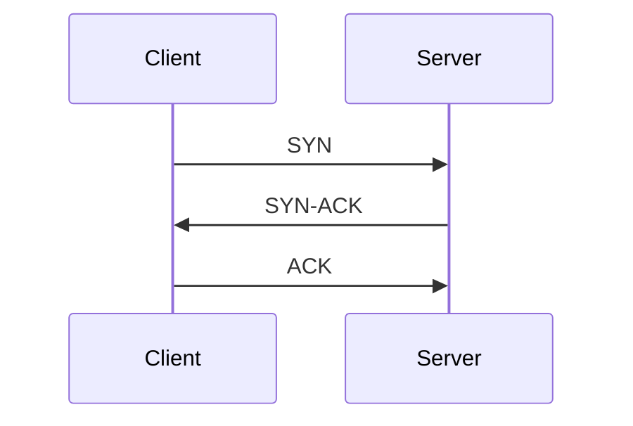

# 🛰️ Communication Protocols

Understanding common communication protocols used in web and network applications.

---

## 🌐 HTTP (HyperText Transfer Protocol)

* Used to transfer data over the web (e.g., websites, REST APIs).
* Operates over a **TCP** connection.
* Each new HTTP request can initiate a new TCP connection (unless persistent connections are used).
* Stateless and supports methods like `GET`, `POST`, `PUT`, `DELETE`.

```txt
Client --(HTTP Request)--> Server
Server --(HTTP Response)--> Client
```

**Example:**
Opening [amazon.com](https://amazon.com) involves multiple HTTP requests to load images, scripts, and content.

---

## 🔁 TCP (Transmission Control Protocol)

* Connection-oriented protocol.
* Ensures **reliable** and **ordered** delivery of data.
* Performs **three-way handshake** before data transfer.



**Example:**
Sending emails, downloading files, or accessing a website.

---

## 🚀 UDP (User Datagram Protocol)

* Connectionless protocol.
* Does **not guarantee delivery**, ordering, or duplicate protection.
* Much **faster** than TCP due to low overhead.

```txt
Client --(Data Packet)--> Server
(no handshake or confirmation)
```

**Example:**
Video conferencing (e.g., Zoom), live gaming, streaming.

---

## ⚡ HTTP/3 (based on QUIC)

* Newer version of HTTP built on top of **UDP** using **QUIC** protocol.
* Allows **multiplexed** requests over a single connection.
* Features:

  * Faster connection setup (0-RTT).
  * Header compression.
  * Better congestion control.

**Example:**
YouTube and Google services for fast, reliable content streaming.

---

## 🔐 HTTPS (HTTP Secure)

* HTTP over **SSL/TLS + TCP**.
* Encrypts all data between client and server.
* Prevents **eavesdropping**, **man-in-the-middle (MITM)** attacks, and **data tampering**.

```txt
Browser --[HTTPS: TCP + TLS]--> Server
Encrypted: Yes 🔒
```

**Example:**
Banking websites, login pages, payment gateways.

---

## 🔄 WebSocket

* Starts with an **HTTP handshake**, then upgrades to a **WebSocket** protocol.
* Enables **bi-directional (full-duplex)** communication.
* Ideal for real-time data exchange.

```txt
Client <==> Server (Live connection)
Both can send/receive messages anytime.
```

**Example:**
Live chats, collaborative editing (e.g., Google Docs), online gaming.

---

## ✉️ SMTP (Simple Mail Transfer Protocol)

* Used for **sending** emails.
* Operates over **TCP**, typically on port 25, 587, or 465 (secure).
* Works in combination with POP3 or IMAP for receiving.

```txt
Client (Email App) --> SMTP Server --> Recipient Mail Server
```

**Example:**
Gmail sending emails via `smtp.gmail.com`.

---

## 📁 FTP (File Transfer Protocol)

* Used for **transferring files** between client and server.
* Can be authenticated or anonymous.
* Operates over **TCP** (typically port 21).

```txt
Client --(FTP)--> Server
Supports: Uploads | Downloads | Rename | Delete
```

**Example:**

## Day 3 — June 20

### Namaste Frontend Design: REST API Notes (Senior Frontend Developer Perspective)

---

### 1. **What is REST API?**

REST (Representational State Transfer) is an architectural style that allows communication between client and server using HTTP protocol.

A **REST API** is an interface that helps the frontend interact with backend services (data exchange via JSON/XML formats).

---

### 2. **Why REST? Benefits**

1. **Simplicity & Ease of Use** — Easy to understand, design, and use.
2. **Stateless** — Each API call is independent; no session/data stored on server between requests.
3. **Scalability** — Supports load balancing; easily scalable system.
4. **Flexible Data Formats** — JSON/XML/HTML/text.
5. **Uniform Interface** — Clear standard rules (HTTP verbs, status codes).
6. **Caching** — Improves performance for non-changing data (like static menu or catalog).
7. **Separation of Concerns** — Frontend and backend can be built in different tech stacks.
8. **Interoperability** — Language agnostic — clients and servers can be in different languages.
9. **Easy Testing & Debugging** — Tools like Postman help in API validation.
10. **Security** — Supports various authentication mechanisms (API keys, OAuth, JWT).

---

### 3. **REST API Building Blocks**

#### **Architecture Diagram:**

```
   Client (Browser / Mobile)
            |    
     [ HTTP Request ]   --->  Server (Backend)
     <--- [ HTTP Response ]
```

#### **Request Components:**

* **URL** (Uniform Resource Locator)
* **HTTP Method** (GET, POST, PUT, DELETE)
* **Headers** (Metadata — e.g., Authentication, Content-Type)
* **Body** (Data Payload for POST/PUT)

#### **Response Components:**

* **Status Line** (HTTP Version + Status Code + Reason Phrase)
* **Headers** (Metadata returned)
* **Body** (Actual Response Data)

#### **Common HTTP Status Codes:**

* **200 OK** — Successful
* **201 Created** — Resource created
* **400 Bad Request** — Client error
* **401 Unauthorized** — Auth required
* **404 Not Found** — Resource missing
* **500 Internal Server Error** — Server failure

---

### 4. **How to Build REST API?**

1. Decide endpoints — what resources (e.g., `/users`, `/products`)?
2. Choose HTTP methods — GET/POST/PUT/DELETE.
3. Design response format (JSON recommended).
4. Handle error codes properly.
5. Secure with authentication (API key, OAuth, JWT).

---

### 5. **Consume REST API (Using Postman)**

* Install Postman.
* Choose Method (GET/POST/etc).
* Enter URL.
* Add Headers (if required).
* Send Request & View Response.

---

### 6. **HTTP 1 / 2 / 3 Differences (High-Level)**

| Feature       | HTTP/1.1              | HTTP/2                   | HTTP/3 (QUIC)                 |
| ------------- | --------------------- | ------------------------ | ----------------------------- |
| Connection    | Multiple TCP          | Single TCP (Multiplexed) | UDP (Multiplexed)             |
| Performance   | Head-of-Line Blocking | Faster, binary framing   | Low latency, built for mobile |
| Security      | Optional TLS          | Mandatory TLS            | Mandatory TLS                 |
| Example Usage | Legacy systems        | Modern web apps          | Experimental/Latest           |

---

### 7. **REST API Best Practices (Creator & Consumer Perspective)**

#### **For API Creator:**

* Use clear & consistent naming (`/users`, `/products`).
* Support filtering, sorting, pagination (`?limit=10&page=2`).
* Use proper HTTP status codes.
* Secure APIs with auth tokens.
* Provide versioning (`/v1/`).

#### **For API Consumer:**

* Handle errors & edge cases.
* Use caching for GET requests.
* Implement retries for transient failures.
* Validate API responses.

---

### 8. **Advanced Concepts - High Level**

#### **System Design Architecture View:**

```
          [ Client (Frontend: React/Angular) ]
                        |
                        V
                 [ REST API (HTTP) ]
                        |
            +----------------------+
            |     Backend Server    |
            +----------------------+
                        |
                 [ Database ]
```

* **1-Tier:** UI + Backend + DB = Same system (Monolith)
* **2-Tier:** Frontend & Backend separated (API in-between)
* **3-Tier:** Frontend -> API Gateway -> Backend + DB (Cloud Native)

#### **Role of REST API:**

* Acts as contract/interface between client and server.
* Defines format, protocol, and behavior of communication.

#### **Communication Format:**

* Mostly JSON (lightweight, easy to parse).

---

### References:

* [https://dummyjson.com/](https://dummyjson.com/)
* Namaste Frontend System Design Course

---

### 🚀 **Express.js Setup**

1️⃣ **Initialize Node project**

```bash
npm init -y
```

2️⃣ **Install Express**

```bash
npm install express --save
```

3️⃣ **(Optional) Use ES6 Modules**
In `package.json`, set:

```json
{
  "name": "systemdesign",
  "version": "1.0.0",
  "description": "RestApi",
  "main": "index.js",
  "type": "module",
  "scripts": {
    "start": "node index.js",
    "test": "echo \"Error: no test specified\" && exit 1"
  },
  "author": "SJ",
  "license": "ISC",
  "dependencies": {
    "express": "^5.1.0"
  }
}
```

4️⃣ **Create `index.js`**

```javascript
import express from 'express';

const app = express();
app.use(express.json()); // Middleware to parse JSON body

const PORT = 5111;

app.listen(PORT, () => {
  console.log(`Server running at http://localhost:${PORT}`);
});
```

---

### 🛠 **Building Blocks**

* **URL Parts**

  ```
  http://www.example.com/forum/questions/tag?key=value#top
  ```

  | Part                   | Description                   |
  | ---------------------- | ----------------------------- |
  | `http://`              | Scheme                        |
  | `www`                  | Subdomain                     |
  | `example`              | Domain                        |
  | `com`                  | TLD                           |
  | `/forum/questions/tag` | Path                          |
  | `?key=value`           | Query parameter               |
  | `#top`                 | Fragment (not sent to server) |

---

### ✅ **CRUD API Features**

Example Base URL:

```
http://localhost:5111/api/todos
http://localhost:5111/api/users
```

| Feature     | HTTP Method | Example                                        |
| ----------- | ----------- | ---------------------------------------------- |
| Create Todo | POST        | `POST /api/todos`                              |
| Read Todos  | GET         | `GET /api/todos`                               |
| Update Todo | PUT/PATCH   | `PUT /api/todos/:id` or `PATCH /api/todos/:id` |
| Delete Todo | DELETE      | `DELETE /api/todos/:id`                        |

Other HTTP methods:

* `HEAD` — Same as GET but no response body
* `OPTIONS` — Describe supported HTTP methods

---

### 📝 **Sample Routes**

```javascript
// Read all todos
app.get('/api/todos', (req, res) => {
  res.send('List of todos');
});

// Create a todo
app.post('/api/todos', (req, res) => {
  res.send('Todo created');
});

// Update a todo
app.put('/api/todos/:id', (req, res) => {
  res.send(`Todo ${req.params.id} updated`);
});

// Delete a todo
app.delete('/api/todos/:id', (req, res) => {
  res.send(`Todo ${req.params.id} deleted`);
});
```

---

### ⚡ **Auto-start server during development**

Install **nodemon**:

```bash
npm install nodemon --save-dev
```

Add to `package.json` scripts:

```json
"scripts": {
  "start": "node index.js",
  "dev": "nodemon index.js"
}
```

Run:

```bash
npm run dev
```

---

### 📌 **System Design Angle**

* Think in terms of RESTful routes.
* Modularize: Separate routes, controllers, and models (even in simple TODO app).
* API best practice: Versioning (e.g., `/api/v1/todos`).

---

👉 **Next enhancement ideas**

* Add validations (e.g., using `Joi` or `express-validator`).
* Connect to a DB (MongoDB / PostgreSQL).
* Implement authentication (JWT / OAuth).

---


