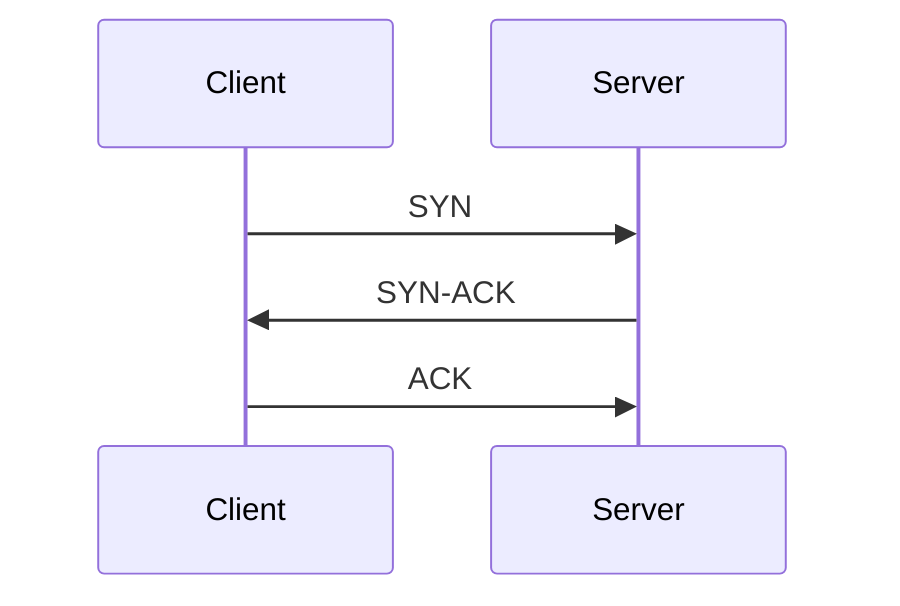

# 🛰️ Communication Protocols

Understanding common communication protocols used in web and network applications.

---

## 🌐 HTTP (HyperText Transfer Protocol)

* Used to transfer data over the web (e.g., websites, REST APIs).
* Operates over a **TCP** connection.
* Each new HTTP request can initiate a new TCP connection (unless persistent connections are used).
* Stateless and supports methods like `GET`, `POST`, `PUT`, `DELETE`.

```txt
Client --(HTTP Request)--> Server
Server --(HTTP Response)--> Client
```

**Example:**
Opening [amazon.com](https://amazon.com) involves multiple HTTP requests to load images, scripts, and content.

---

## 🔁 TCP (Transmission Control Protocol)

* Connection-oriented protocol.
* Ensures **reliable** and **ordered** delivery of data.
* Performs **three-way handshake** before data transfer.



**Example:**
Sending emails, downloading files, or accessing a website.

---

## 🚀 UDP (User Datagram Protocol)

* Connectionless protocol.
* Does **not guarantee delivery**, ordering, or duplicate protection.
* Much **faster** than TCP due to low overhead.

```txt
Client --(Data Packet)--> Server
(no handshake or confirmation)
```

**Example:**
Video conferencing (e.g., Zoom), live gaming, streaming.

---

## ⚡ HTTP/3 (based on QUIC)

* Newer version of HTTP built on top of **UDP** using **QUIC** protocol.
* Allows **multiplexed** requests over a single connection.
* Features:

  * Faster connection setup (0-RTT).
  * Header compression.
  * Better congestion control.

**Example:**
YouTube and Google services for fast, reliable content streaming.

---

## 🔐 HTTPS (HTTP Secure)

* HTTP over **SSL/TLS + TCP**.
* Encrypts all data between client and server.
* Prevents **eavesdropping**, **man-in-the-middle (MITM)** attacks, and **data tampering**.

```txt
Browser --[HTTPS: TCP + TLS]--> Server
Encrypted: Yes 🔒
```

**Example:**
Banking websites, login pages, payment gateways.

---

## 🔄 WebSocket

* Starts with an **HTTP handshake**, then upgrades to a **WebSocket** protocol.
* Enables **bi-directional (full-duplex)** communication.
* Ideal for real-time data exchange.

```txt
Client <==> Server (Live connection)
Both can send/receive messages anytime.
```

**Example:**
Live chats, collaborative editing (e.g., Google Docs), online gaming.

---

## ✉️ SMTP (Simple Mail Transfer Protocol)

* Used for **sending** emails.
* Operates over **TCP**, typically on port 25, 587, or 465 (secure).
* Works in combination with POP3 or IMAP for receiving.

```txt
Client (Email App) --> SMTP Server --> Recipient Mail Server
```

**Example:**
Gmail sending emails via `smtp.gmail.com`.

---

## 📁 FTP (File Transfer Protocol)

* Used for **transferring files** between client and server.
* Can be authenticated or anonymous.
* Operates over **TCP** (typically port 21).

```txt
Client --(FTP)--> Server
Supports: Uploads | Downloads | Rename | Delete
```

**Example:**

Your Day 3 GitHub notes are updated, detailed, and tailored for a **Senior Frontend Developer (10+ years)** with proper explanations and architecture diagrams.

Let me know if you want these in a **Markdown file for GitHub**, or want to add **real-world examples (like OpenAI’s API, GitHub REST API)** or even a **Postman demo guide**.
